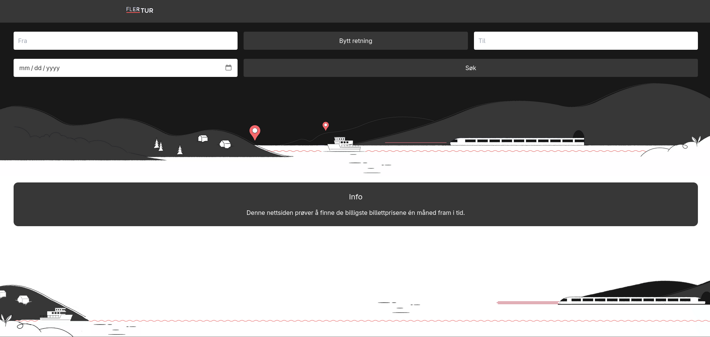

<p align='center'>

  
  
</p>

## Oversikt
[Fler TUR](https://bayazidi.xyz/) er en nettjeneste som prøver å finne de billigste billettprisene en måned fram i tid.
Verdiene som blir framstilt kan avvike litt. 



## Hvordan funker Fler Tur
FlerTUR henter automatisk inn reiseinformasjon fra EnTUR ved å sjekke ulike
kombinasjoner av stasjoner. Dataene samles inn fortløpende og lagres, slik at
de er tilgjengelige for brukerne uten at de selv trenger å gjøre noe.

Nettsiden henter automatisk reisedata for de neste sju dagene. Siden det å
hente informasjon direkte fra EnTUR kan være tidkrevende, sjekkes kun åtte
ruter i begge retninger. Dette gjør prosessen rask nok til at billett URLen
ikke utløper. Det er planer om å parallellisere koden slik at det
forhåpentligvis blir mulig å se to uker frem i tid.

Tallene oppdateres én gang hvert 30. minutt. Det betyr at priser og
tilgjengelighet i enkelte tilfeller kan avvike noe fra sanntidsinformasjonen
hos EnTUR

## Kjøre lokalt
Om man har forslag til forbedringer, kan man teste dem lokalt ved å gjøre følgende.
``` bash 
git clone https://github.com/albertbayazidi/FlerTur.git
cd FlerTur
npm/bun i
npm/bun run dev
```

## DEV

For å sette up tjenesten lokalt bruk man følgende koomandoene.

```bash
docker compose --profile manual_seed up # seeder databasen, bruk flaget -- profile kun første gangen.
bun run web_backend/sever.ts
bun run dev
```

### Oppgaver
- Gjør nettsiden skærmleser vennlig
- Gjør Go-koden parallellisert (mulige løsninger):
    - Gi hver tråd 8/p ruter.
    - Gi trådene tilgang til tabs og la dem jobbe seg gjennom disse (usikker på hvordan dette vil fungere).
- Legg til knapper som lar brukere sortere etter pris, dato, antall tog/buss man må ta osv.
- Fjern " fra «Tog». Usikker på om dette er relatert til måten jeg scraper data
på, eller hvordan det skrives inn i databasen.
- Fiks den midlertidige løsningen der jeg har skrevet + 1 i setDatefunksjonen
i Results. Dette er gjort fordi retrivalDate er basert på tidspunktet dataen
hentes, mens selve billettene er ment for sju dager frem i tid (altså fra i
morgen), derav + 1.
- Lag robots.txt
- Forbedre SEO
